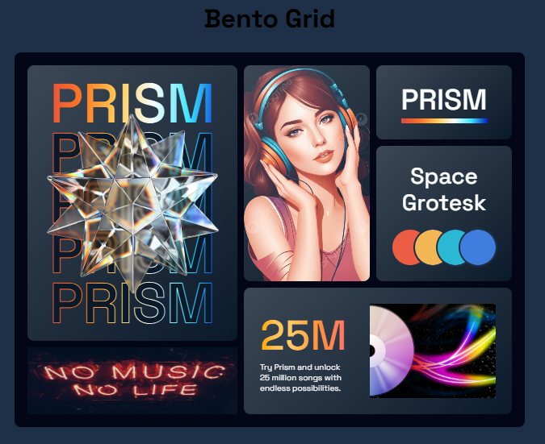

# Bento Grid

Ejemplo de diseño **Bento Grid** con CSS y HTML.  
Este proyecto demuestra cómo estructurar un layout estilo “bento” usando solo HTML y CSS, ideal como base o inspiración para páginas con diseño modular.

---

## Tabla de Contenidos

- [Características](#-características)  
- [Capturas](#-capturas)  
- [Demo](#-demo)  
- [Tecnologías](#-tecnologías)  

---

## Características

- Diseño modular tipo “bento” (cuadrícula irregular)  
- Solo con **HTML** y **CSS**  
- Responsive — se adapta a distintos tamaños de pantalla  
- Fácil personalización de tamaños y disposición de módulos  
- Código limpio y ligero  

---

## Capturas
 

---

## Demo
https://brayanhl17.github.io/Bento-Grid

---

## Tecnologías

- **HTML5**  
- **CSS3** (grid, flexbox, media queries)  

(No utiliza frameworks ni JavaScript)

---
